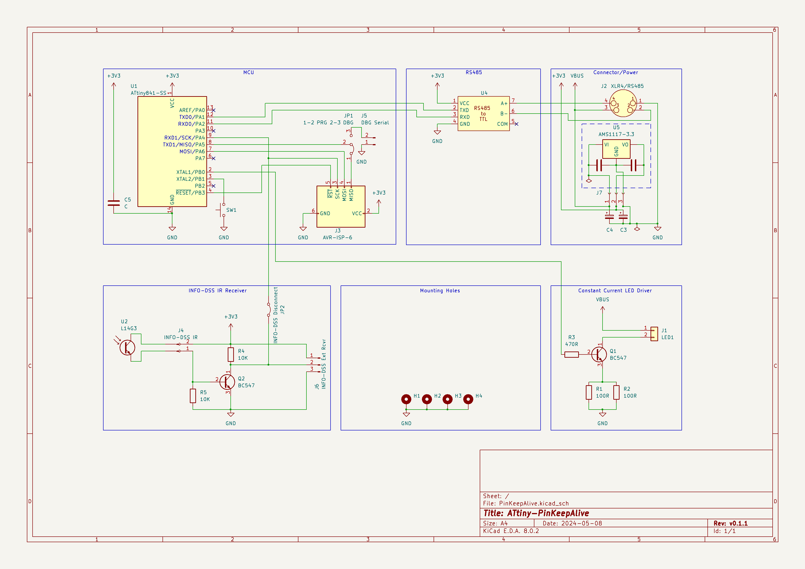

# ATtiny-PinKeepAlive

Flash in the PIN for my utility electricity meter via white LED, then keep the PIN active by flashing the LED briefly every 100 seconds.

In parallel, read INFO-DSS SML datagrams via IR diode input, decode for a number of OBIS codes and expose the received values via Modbus RTU over a serial line, in my case RS-485.

# Why?

The electricity power meter supplied by my local power company came mis-configured so there's no way to enable extended INFO-DSS IR datagrams permanently.
The respective menu item has been configured away. Thank you very much!

After PIN entry, the extended datagrams do appear, but only for 120 seconds. After that, the unit falls back to basic datagrams again, requiring another PIN entry. Alternatively, we just simulate some activity so that the 120 second window does not close. By repeated light signals, we're keeping the unit in "extended" mode, so to say.

Without the PIN, my meter emits 1.8.0 and 2.8.0 with kWh resolution only (xxx000 W) and does not emit instantaneous power at all. After PIN entry, all three values are emitted and with Watt granularity.

# Manual operation

A button is connected to a small microcontroller (ATtiny841) and makes a LED light up when pressed. The button is de-bounced so that a minimum LED "on" duration of around half a second is maintained. The button can be pressed for longer, extending the "on" period, which enables entry of "long" press light impulses.

In short, this function converts the error-prone manual flashing contraption to simple button presses.

# Automatic PIN entry

Upon reset, the microcontroller enters austomatic mode. It remains in automatic mode unless the button is pressed.
In automatic mode, the unit first
- emits a short flash to enter the display test page (all display segments activated)
- emits another short flash to proceed to the PIN entry page. With my meter, the display's 2nd line now shows '-0...-' and waits for the first digit.

Then, for each of the (four) digits of the PIN,
- a sequence of short flashes, each followed by a brief OFF pause is emitted, according to the digit value.
- Between digits, we need a pause of about 3-4 seconds. The meter detects this inactivity and switches to the next PIN position automatically.

As we do not have any feedback from the meter (neither IR nor visual) we can do nothing but try and wait for a similar amount of time. Note this cannot be super reliable. If the period is set too short, we're bumping up the current digit too much and if we wait for too long we can skip a digit, causing one or more spurious 0 digits.

The PIN is hard-coded in the source code / microcontroller. To define the PIN, copy file `meterpin-sample.h` to `meterpin.h` and adjust that copy to your PIN. Then build and upload. Setting the PIN to an empty string disables PIN entry, leaving only the Modbus-RTU function, see below.

# Keep Alive

After the automatic PIN entry or the last button press, the unit waits for 100 seconds, then emits a half-second LED flash and repeats. Pressing the button interrupts this waiting period and causes an immediate flash.

This short flash once in a while simulates some activity to the power meter so it does not ever reach the 120 second (2 minute) PIN timeout.

Consequently, the extended SML datagrams continue to be emitted. Mission accomplished.

# Repeat PIN entry

One reviewer suggested to enter the PIN again, regularly, to guard against unexpected meter resets and/or unexpected microcontroller resets.
So, after about 20 minutes, the unit now waits for a bit longer than the keep-alive period (130s, extended wait period), then blinks in the PIN again.

# What the heck?

I still have not found the reason why anybody would want to configure away the option to emit extended datagrams permanently. What's the purpose?!

While my unit is an [Easymeter Q3A](https://www.easymeter.com/downloads/products/zaehler/Q3A/BA_Q3A_V10.09_Rev19_2021-06-14.pdf), I believe there may be other types of meters with similar (stupid?) config options.

# Modbus RTU Details

The unit's address is fixed to 0x09. Function code 0x04 (Read Input Registers) is the only function code supported.

Four values are exposed. Each value is a 32bit value, readable through two consecutive registers.

| Address  | Content                                            | Unit | Data type               |
|----------|----------------------------------------------------|------|-------------------------|
| 256, 257 | Version number                                     |      | 32 bit unsigned integer |
| 258, 259 | 1-0:1.8.0 Positive active energy (A+) total        | Wh   | 32 bit unsigned integer |
| 260, 261 | 1-0:2.8.0 Negative active energy (A+) total        | Wh   | 32 bit unsigned integer |
| 262, 263 | 1-0:16.7.0 Sum active instantaneous power (A+ - A-)| W    | 32 bit signed integer   |

Example readout using "modpoll" (https://www.modbusdriver.com/modpoll.html):

    modpoll -t 3:int -a 9 -0 -r 256 -c 4 -i -1 -b 115200 -s 2 COM6

    modpoll -t 3:hex -a 9 -0 -r 258 -c 6    -1 -b 115200 -s 2 COM6

The SML decoder accepts 64-bit raw values internally, but after application of the "scaler" it is expected that the resulting
value fits into 32 bits. Indeed my unit always uses an 8-octet fixed-length zero-padded integer representation for all measurement
values:

    07 01 00 01 08 00 FF                1–0:1.8.0
    62 1e                               Unit
    52 03                               Scaler 10^3
    59 00 00 00 01 18 CB 47 05          0x118CB4705 <=> 4710942469, scaled to 471094 Wh, displayed on the unit as 471 kWh

# Hardware Design

I've prepared the schematics and a PCB using [KiCad 8.0.2](https://www.kicad.org/). Find respective project files under the [kicad/](kicad/) folder:
* [kicad/PinKeepAlive.kicad_pcb](kicad/PinKeepAlive.kicad_pcb)
* [kicad/PinKeepAlive.kicad_sch](kicad/PinKeepAlive.kicad_sch)

# Notes

- None of the values are critical, I believe.
- Use a small 100nF blocking condensator as C5, and position that near the MCU
- In the power supply section, I used 47uF/16V for C3, C4 which I had lying around. For the VBUS that I use a rating of 16V suffices, but please adapt when you supply with a higher voltage.
- The infrared phototransistor L14G3 is __ancient__ and comes from my forgotten parts bin. See https://wiki.volkszaehler.org/howto/simpler_ir_leser for other devices that people have found to work OK.
- By way of connector J6, you can also add a normal UART SmartMeterReader (e.g. [Amazon](https://www.amazon.de/bitShake-SmartMeterReader-UART-IR-Lesekopf/dp/B09XRC6VYW)). No need to populate U2, R4, R5, Q2 in this case, of course.
- The RS485 module can be obtained from AliExpress, Ebay, Amazon, or https://www.makershop.de/module/kommunikation-module/ttl-rs485-adapter/
- Same for the AMS1117-3V3 module. The 3-pin variant can be soldered easily and allows VBUS of up to 15V: https://www.berrybase.de/step-down-converter-5v-3-3v/800ma-mit-pin-header
- For the very short RS485 cable that I use, no 120 Ohm termination resistor is required. For longer cable lengths, be sure to terminate the RS485 bus at either end, usually by closing a solder bridge on the RS485 module.

# Caveats

- The LED needs to cause a light stream of at least 400lux at the receiver. I found that a random LED flashlight that I "deconstructed" for the purpose worked nicely: Originally driven by 3x AAA, the LED seems to be OK with being driven by nearly 5V (at 100mA). I ended up using a constant-current circuit (http://www.loosweb.de/constant_current_sources/doc/en/index.html point 8) where the current is determined by the 50Ohms resistor (2x 100Ohms parallel is what I had). The flashing I get this way is strong enough for my meter.
- (Update) Now that my meter emits long datagrams without any further ado, I simply disconnected the LED part and use the RS485 portion only.
- The timing of this whole PIN entry scheme is not overly critical, but certainly not fool-proof either. After all, it's intended for manual operation. Especially, the inter-digit delays may give you a problem. In this case, please adjust `DIGIT_GAP2_TICKS` in code and re-try.
- If your meter happens to __not__ have a sticker preventing access to the MSB-DSS (IR transmitter/receiver, lucky you!), you want to check there first, as the MSB-DSS may well emit extended datagrams irrspective of PIN entry status - that is, even without a PIN!
- Why ATtiny841? Well, that was the nearest unit I happened to find on my workbench. And it's got two hardware serial ports, which I use now to read the SML and forward that via wired RS485. Of course, for the basic LED flash function any Arduino-like microcontroller
with some form of periodic interrupt should work.
- Note that during the last seconds of the extended wait period, plus the seconds it takes to re-enter the PIN, the meter will send out reduced datagrams again. Please ping me when you know a way around this.
- Please note that Modbus-RTU **requires** eleven bit times per character on the line. This means that when __not__ using any parity one must use **two** stop bits (start bit, 8 character bits, 2 stop bits == 11 bits). While some tools worked with just one stop bit  (modpoll), I found that others do not! Yes, especially PyModbus did rightfully **not** work unless the unit was configured to two stop bits. And that's critical as my HomeAssistant Modbus integration uses PyModbus under the covers.
